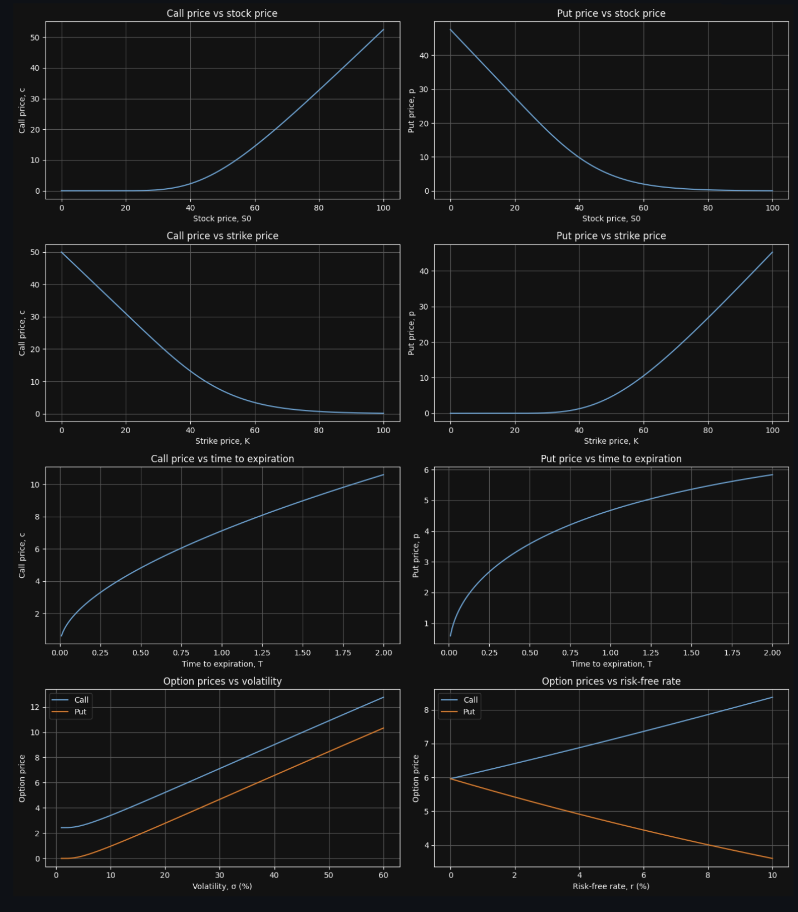
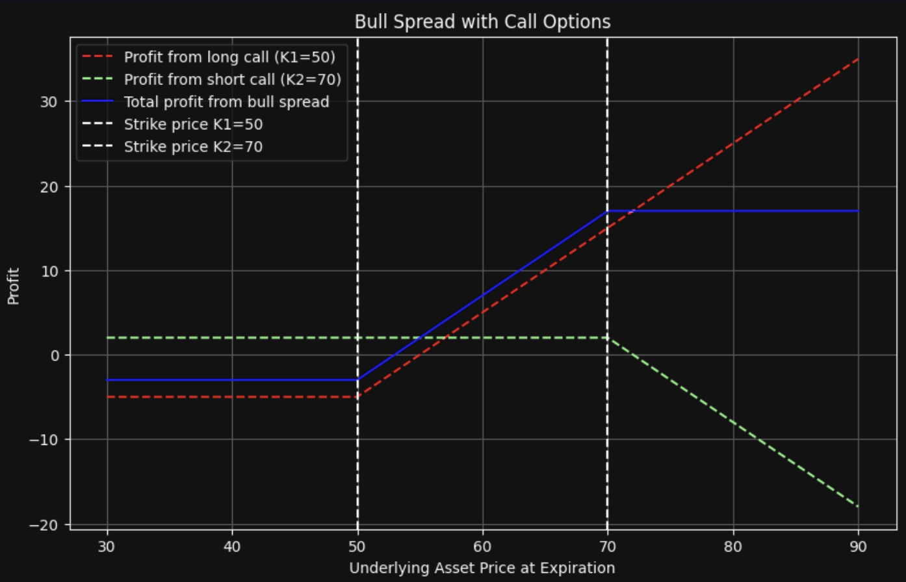
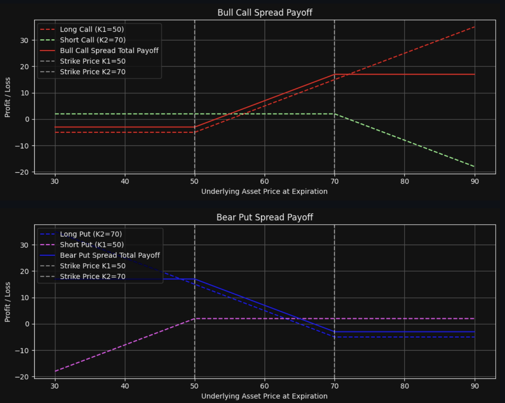
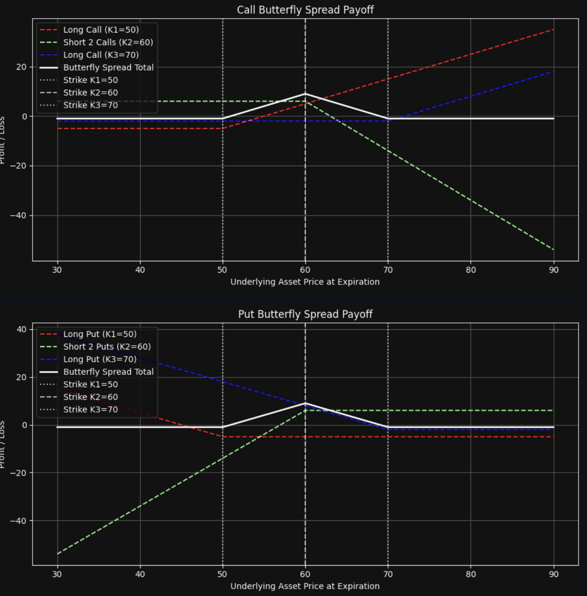
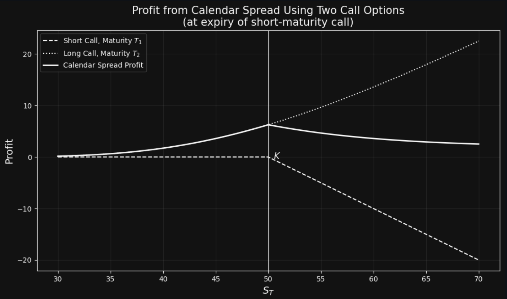
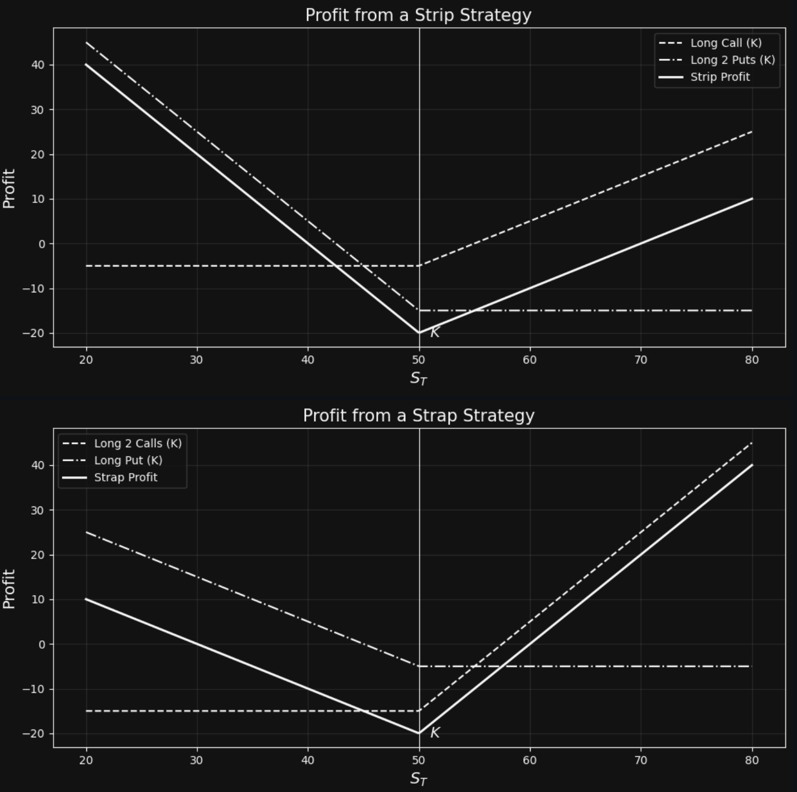

## **1. Profit Formula**

For a **put option** example:

$$
\text{Profit} = (\text{Strike Price} - \text{Stock Price at Expiration}) - \text{Option Cost}
$$

***

## **2. Option Leverage**

Two equivalent ways to express **option leverage**:

$$
\text{Leverage} = \frac{\Delta}{\text{Stock Price}} \times \text{Option Price}
$$

Where **Δ (delta)** measures the sensitivity of the option’s price to changes in the underlying stock price.

***

## **3. Writing Naked Options**

A **naked option** is an option position **not hedged** with an offsetting position in the underlying asset or another option.
Example: Selling a call option **without owning** the underlying stock.

***

## **4. Factors Affecting Option Prices**

1. Current stock price $S_0$
2. Strike price $K$
3. Time to expiration $T$
4. Volatility $\sigma$
5. Risk‑free interest rate $r$
6. Dividends expected to be paid (present value $D$)

***

## **5. Lower Bounds for European Options**

**European Call (no dividends):**

$$
C \ge \max(S_0 - K e^{-rT}, 0)
$$

**European Put (no dividends):**

$$
P \ge \max(K e^{-rT} - S_0, 0)
$$

***

**When dividends with present value \$ D \$ will be paid:**

**European Call:**

$$
C \ge \max(S_0 - D - K e^{-rT}, 0)
$$

**European Put:**

$$
P \ge \max(K e^{-rT} + D - S_0, 0)
$$

***

## **6. Trading options*

### Option + Asset

**Call price:**

$$
C = P + S_0 - K e^{-rT} - D
$$

**Put price:**

$$
P = C + K e^{-rT} + D - S_0
$$

### Spreads 
A spread trading strategy involves taking a position in two or more options of the same type (i.e., two or more calls or two or more puts).

#### Bull spreads
This can be created by buying
a European call option on a stock with a certain strike price and selling a European call option on the same stock with a higher strike price. Both options have the same expiration date. An investor who enters into a bull spread is hoping that the **stock price will increase**.

Payoff from a bear spread created with put options.

| Stock price range        | Payoff z long call | Payoff z short call | Total payoff |
|--------------------------|--------------------|---------------------|--------------|
| $S_T \leq K_1$           | $0$                | $0$                  | $0$          |
| $K_1 < S_T < K_2$        | $S_T - K_1$        | $0$                  | $S_T - K_1$  |
| $S_T \geq K_2$           | $S_T - K_1$        | $- (S_T - K_2) $          | $K_2 - K_1$  |

#### Bear spreads
An investor who enters into a bear spread is hoping that the **stock price will decline**. Bear spreads can be created by buying a European put with one strike price and selling a European put with another strike price. The strike price of the option purchased is greater than the strike price of the option sold (This is in contrast to a bull spread, where the strike price of the option purchased is always less than the strike price of the option sold.)
 
 

Payoff from a bear spread created with put options.

| Stock price range        | Payoff z long put | Payoff z short put | Total payoff |
|--------------------------|-------------------|--------------------|--------------|
| $S_T \leq K_1$           | $K_1 - S_T$       | $K_2 - S_T$         | $K_2 - K_1$  |
| $K_1 < S_T < K_2$        | $K_2 - S_T$       | $0$                 | $K_2 - S_T$  |
| $S_T \geq K_2$           | $0$               | $0$                 | $0$          |

#### Box spreads
A box spread is a combination of a bull call spread with strike prices $K_1$ and $K_2$ and a bear put spread with the same two strike prices. The payoff from a box spread is always $K_2 - K_1$. The value of a box spread is therefore always the present value of this payoff or $K_2 - K_1)e^{-rT}$. If it has a different value there is an arbitrage opportunity.

Payoff from a box spread

| Stock price range        | Payoff z bull call spread | Payoff z bear put spread | Total payoff |
|--------------------------|---------------------------|--------------------------|--------------|
| $S_T \leq K_1$           | $0$                       | $K_2 - K_1$               | $K_2 - K_1$  |
| $K_1 < S_T < K_2$        | $S_T - K_1$               | $K_2 - S_T$               | $K_2 - K_1$  |
| $S_T \geq K_2$           | $K_2 - K_1$               | $0$                       | $K_2 - K_1$  |

#### Butterfly spreads 
A positions in options with three different strike prices. It can be created by buying a European call option with a relatively low strike price $K_1$, buying a European call option with a relatively high strike price $K_3$, and selling two European call options with a strike price $K_2$ that is halfway between $K_1$ and $K_3$. Generally, $K_2$ is close to the current stock price. 

Payoff from a butterfly spread

| Stock price range        | Payoff z 1. long call | Payoff z 2. long call | Payoff z short calls     | Total payoff |
|--------------------------|----------------------|-----------------------|--------------------------|--------------|
| $S_T \leq K_1$           | $0$                  | $0$                   | $0$                      | $0$          |
| $K_1 < S_T \leq K_2$     | $S_T - K_1$           | $0$                   | $0$                      | $S_T - K_1$  |
| $K_2 < S_T < K_3$        | $S_T - K_1$           | $0$                   | $-2 (S_T - K_2)$          | $K_3 - S_T$  |
| $S_T \geq K_3$           | $S_T - K_1$           | $S_T - K_3$           | $-2 (S_T - K_2)$          | $0$          |
> These payoffs are calculated using the relationship $K_2 = 0.5(K_1 + K_3)$

--- 
#### Calendar spreads
We now move on to calendar spreads in which the options have the same strike price and different expiration dates. A reverse calendar spread is the opposite to that in Figures 12.8 and 12.9. The investor buys a short-maturity option and sells a long-maturity option. A small profit arises if the stock price at the expiration of the short-maturity option is well above or well below the strike price of the short-maturity option. However, a loss results if it is close to the strike price.

### Combinations 
A combination is an option trading strategy that involves taking a position in both calls and puts on the same stock. We will consider straddles, strips, straps, and strangles.

#### Stradle 
involves buying a European call and put with the same strike price and expiration date. If the stock price is close to this strike price at expiration of the options, the straddle leads to a loss. However, if there is a sufficiently large move in either direction, a significant profit will result. A straddle is appropriate when an investor is expecting a large move in a stock price but does not know in which direction the move will be.

Payoff from a straddle
| Stock price range   | Payoff z call     | Payoff z put      | Total payoff   |
|---------------------|-------------------|-------------------|----------------|
| $S_T \leq K$        | $0$               | $K - S_T$         | $K - S_T$      |
| $S_T > K$           | $S_T - K$         | $0$               | $S_T - K$      |

#### Strips and Straps 
A strip consists of a long position in one European call and two European puts with the same strike price and expiration date. A strap consists of a long position in two European calls and one European put with the same strike price and expiration date. In a strip the investor is betting that there will be a big stock price move and considers a decrease in the stock price to be more likely than an increase.

